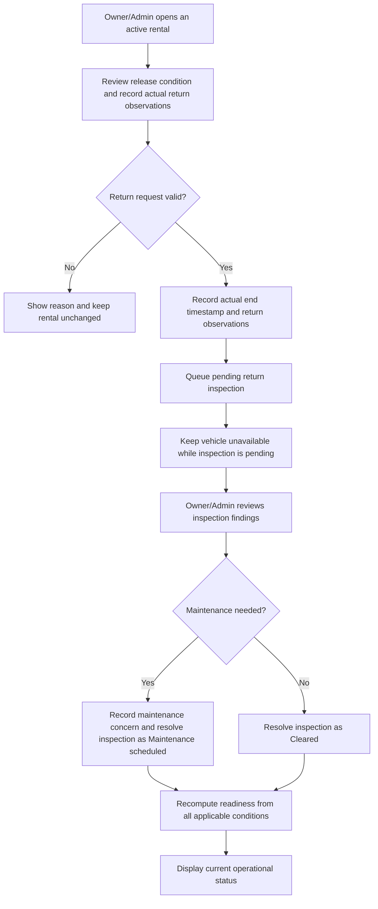

# Manuscript and system audit

Audit date: 26 September 2026

The manuscript needs further revision before it can describe the delivered system accurately. The most consequential gaps concern pricing, down payments, financial settlement, the database dictionary, and the evidence used to evaluate forecasting. Corrections with sufficient evidence were applied to the Google Doc **Paper** tab and the local application. Where commercial-policy boundaries remain unverified, apply the separately documented [researcher-designed policy baseline](2026-09-26-researcher-designed-policy-baseline.md); do not present it as the participating car rental business's approved commercial policy.

## Scope and evidence

- Source manuscript: `/Users/aldrich/Downloads/Manuscript.pdf`, 375 pages. Page references below are **physical PDF pages**, before the Google Doc edits, rather than the printed page numbers. The edited document may repaginate.
- Editable manuscript: [Proposal Paper](https://docs.google.com/document/d/1_s6T6c0cyVwh-LFgxgBNejsC92rhiFcQFQUySJQTpjE/edit?tab=t.0), **Paper** tab. The Final tab was not edited.
- Implementation: repository source and SQL migrations. This is a local implementation audit, not certification of the deployed database, provider credentials, production permissions, or live workflows.
- Client baseline: [interview ground truth](24-client-interview-ground-truth.md), [clarification register](14-client-clarification-register.md), and the client video review described below.
- This is a targeted manuscript-to-code audit. It does not claim a complete line edit of all 375 pages, verification of every citation, or full transcription of the video collection.

### Video evidence limits

The download collection contains 114 distinct MP4s. Earlier work extracted thumbnail text across the collection, sampled frames from approximately eight videos, and used the Verbatim transcription engine for **three** videos. These are different levels of evidence; 114 downloaded videos does not mean 114 transcribed videos.

| Video ID | Evidence used | Relevant finding and limit |
| --- | --- | --- |
| 7642721897204944148 | Verbatim audio transcript, approximately 63 seconds | Excess time described as PHP 300 per hour; mentions carwash, damage/fines, release photo/video and dashcam. Carwash amount was not established. Conflicts with the interview's partially confirmed PHP 3,000 under-six-hour rule. |
| 7689460293210049800 | Verbatim audio transcript, approximately 60 seconds | Deposit refund is conditional on post-return inspection; damage, missing accessories, cleanliness and later violations matter. Does not establish a complete deposit/refund calculation. |
| 7613011608025042196 | Verbatim audio transcript, approximately 31 seconds | Return fuel and RFID balance requirements; no cash refund described. Travel example is **Antipolo to Tagaytay**, not Bicol to Tagaytay. |

Visible promotional material includes 12-hour offers and changing long-term minimum durations. These are dated offers, not a confirmed current universal rate schedule. Do not turn promotional prices, inferred fleet counts, or an individual travel example into system-wide policy.

## Changes completed

### Google Doc Paper tab

Find-and-replace was restricted to the current tab, with a visible match before each replacement and a replacement confirmation afterward.

1. Replaced Resend/React Email with Brevo transactional email in the development-tools table and narrative.
2. Replaced Vitest with the Node.js built-in test runner and identified React Testing Library as planned rather than part of the existing suite. Corrected the unit-test and component-test table descriptions as well.
3. Corrected three provider descriptions and the tools inventory cell: Geoapify with LocationIQ fallback for geocoding; TomTom/HERE for routing and traffic. Added location-quality, freshness, and coverage limits.
4. Revised the purpose statement to physical return and operational inspection, with financial settlement outside the current workflow.
5. Revised objective 3 and the recommendation scope: optional destination is retained for administrative review and does not affect customer recommendation ranking.
6. Revised objective 4: forecasts are weekly confirmed booking-start counts by branch and vehicle category, not concurrent vehicle occupancy.
7. Explained the provisional daily-rate estimate, upward rounding of started 24-hour periods, optional budget filtering, and absence of package, deposit, delivery, or final-price calculation.
8. Relabeled the descriptions of Rental_Charges and Operational_Expenses as proposed future structures, rather than existing database tables.

These edits do not regenerate embedded diagrams, rewrite the complete database dictionary, verify all references, or refresh the contents and figure/table lists. The register below identifies that remaining work explicitly.

### Application

- A pickup and return on the same future calendar date can now be selected, allowing a 12-hour interval. The existing earliest-booking-date restriction remains a separate policy question.
- Date selection validates a positive interval using the selected times. Equal or reversed times cannot be applied.
- Duration labels report actual elapsed days, hours and minutes, instead of showing a partial day as one full day.
- Booking and finder copy identify daily-rate calculations as reference estimates and direct users to confirm the applicable rate. No promotional price or overtime rule was hard-coded.
- Added a researcher-designed, Owner/Admin-maintained rate-card and approved-subtotal workflow. It versions the selected package, delivery fee and approved discount, computes the 50% down-payment threshold in the database, and prevents payment submission until a quote exists. Quotes lock once payment is pending or verified. This migration has not been applied to a database in this workspace.
- Added missing Geoapify and LocationIQ display names in the administrative context service.
- Corrected TypeScript errors in OAuth narrowing, sign-in error fallback, idempotency-key parameter types, optional maintenance readiness, validated audit filters and supply-request input typing.
- Restored database relationship and RPC type metadata from existing migration definitions. This did not alter the database or apply migrations.
- Corrected outdated geocode and notification test fixtures to match their current data contracts.

### Verification performed

- 54 targeted tests passed during the rental-duration and reference-estimate changes: rental-duration, vehicle-finder, finder-booking, customer-lifecycle and payment-integrity suites.
- The first full TypeScript check reported 24 errors. After the stabilization changes, `npx tsc --noEmit --pretty false` passed.
- `npm run build` passed for client and server output. Build success does not establish live workflow, mobile usability, external provider or production database correctness.
- Exported the edited Paper tab and confirmed the main corrections in the 375-page PDF. Visually inspected the revised pricing and tools pages; this was a targeted layout check, not a complete final typesetting review. `git diff --check` passed.
- Existing unrelated local changes were preserved. No production migration or deployment was performed.

## Manuscript correction register

| Priority | Source pages | Finding | Required correction or evidence | Status |
| --- | --- | --- | --- | --- |
| High | 215–216, Figures 51–52 | Return settlement and penalty recording exceed the implemented workflow. | Replace Figure 51 with physical return, pending inspection, inspection resolution and readiness recomputation. Move financial settlement and penalty ledger to future scope. Replacement flow is provided below. | Purpose corrected; embedded figures remain to be replaced. |
| High | 241–257 | Dictionary describes INT(11), DATETIME, conceptual names and several absent structures. Actual implementation is PostgreSQL, uses UUID identifiers, and stores return/inspection data on rental_transactions. | Rebuild the implemented dictionary from migrations; separate future quotations, charge ledger and general expenses. Update ERD relationships at the same time. | Charge/expense descriptions corrected; full dictionary/ERD outstanding. |
| High | 249–251 | Payment dictionary implies a broad payment and final-settlement model. | Document payments, payment_methods and versioned payment_proofs; separate verification status from required-down-payment adequacy. Current manual payment support is not a settlement ledger. | Rate quote and required 50% threshold implemented locally; dictionary revision and controlled database test remain. |
| High | 281–285 | Forecast method is defined, but usable client data and empirical validation must be demonstrated. | Record data provenance, observation dates, branch/category coverage, exclusions, cutoff, missing periods and train/evaluation windows. Report genuine held-out results; keep illustrative calculations labeled examples. | Objective clarified; empirical evidence still required. |
| High | 281–291 | Weekly booking count and number of simultaneously needed vehicles have different units, especially for multi-day rentals. | Present supply/allocation output as an advisory planning proxy. Validate occupancy separately or design a duration-aware demand model as a future enhancement. | Objective clarified; propagate to allocation interpretation/results. |
| High | 292 | Daily-rate estimate can exclude a vehicle affordable under a 12-hour or long-term offer. | State the rounding convention and limitation; support optional budget filtering and manually confirmed rates until a rate policy is approved. | Wording and UI corrected; local researcher-designed rate-card workflow added. |
| Medium | 38, 41, 43 | Destination and settlement claims exceed actual behavior. | Keep destination as administrative context and physical return distinct from financial settlement. | Targeted prose corrected. |
| Medium | 45, 315, 317–318 | Geocoding providers were outdated. | Geoapify/LocationIQ geocoding; TomTom/HERE route and incident sources; no implied vehicle-specific travel authorization. | Three prose descriptions and provider inventory cell corrected; diagrams still need cross-checking. |
| Medium | 277–280 | Notifications, audit and backup dictionaries use conceptual fields/names. | Map recipient_user_id/read_at and deterministic event identity; audit_events supported semantic domains; backup_runs, backup_artifacts and recovery_drills. | Open. |
| Medium | 278–280 | Generic audit and backup language can overstate coverage or recovery guarantees. | Specify actual audited events. Treat RPO 24 hours, RTO 4 hours and retention 14 days as targets/configuration; attach successful backup/restore-drill evidence before claiming achieved recovery. | Open. |
| Medium | 313–318 | Tool list mixed current implementation with planned tools. | Separate installed test runner and Brevo from planned component/E2E/API testing. Tool names alone are not evidence that a workflow passed. | Core names and component-test status corrected; evidence table still needed. |
| Medium | 287–288 | Idle-day threshold is a researcher baseline. | Label 14 days as provisional; explain consecutive eligible idle days from implementation instead of implying an arbitrary calendar gap equals idle time. | Open. |
| Medium | 12 | Equipment quantities and tracker count need primary evidence. | Verify original inventory/interview; a tracker quantity does not prove total active fleet size. | Open. |
| Medium | 1 | May 2026 cover date predates later implementation and video evidence. | Authors must choose the correct proposal/submission version date and an explicit evidence cutoff. Do not backdate later evidence. | Author decision required. |
| Medium | 3–7 | Contents and figure/table lists are stale; methodology is listed at printed page 90 but begins around printed page 149 in the supplied PDF. | Refresh headings, captions and cross-references after substantive revisions and recheck the final export. | Open. |
| Medium | 360–375 | Reference duplicates/incomplete entries undermine traceability. | Deduplicate identical DOI entries for Mohamad and Suganya; verify authors, years, titles, DOI completeness and every in-text citation against the original sources. | Verification backlog; no unsupported source repair applied. |

## Database mapping for the replacement dictionary

The following is a correction guide, not a claim that conceptual fields can be renamed one-for-one.

| Manuscript structure | Implemented source | Revision instruction |
| --- | --- | --- |
| Booking_Requests | booking_requests | Use actual requested/assigned vehicle UUIDs, customer_id, pickup_at/return_at, branch IDs and workflow fields. Do not describe rental_duration_option as an existing column. |
| Payments | payments + payment_methods + payment_proofs | Explain manual verification, required_amount/submitted_amount and versioned proof files. Do not claim current card processing or final-balance accounting. |
| Rentals | rental_transactions | Use scheduled and actual timestamps, release/return observations and inspection fields. An ended rental is not proof of financial settlement. |
| Rental_Return_Inspections | rental_transactions.inspection_* | Explain Pending, Cleared and Maintenance scheduled states. A separate detailed inspection table is a future design, not the current schema. Legacy backfilled Cleared values do not prove a new physical inspection took place. |
| Rental_Charges | No corresponding implemented ledger found | Future scope; client-approved schedule and accounting design required. |
| Operational_Expenses | No general implemented expense ledger found | Future scope. maintenance_records.cost_php is narrower. |
| Rate cards and approved quotes | rate_cards + booking_rate_quotes (local migration pending application) | Describe the researcher-designed per-vehicle package card, approved subtotal, delivery fee, discount, version and 50% down-payment threshold. It is not a final settlement, deposit, refund or penalty ledger. |
| Notifications | notifications | Document actual recipient, read timestamp, entity binding and event identity from migrations. |
| Audit_Logs | audit_events | Document supported semantic domains and append-only behavior rather than universal activity logging. |
| Backup_Logs | backup_runs + backup_artifacts + recovery_drills | Describe separate backup execution, stored artifact and restore evidence. |

Relevant authoritative files include `supabase/migrations/20260831150000_booking_requests.sql`, `20260831220000_payment_submission.sql`, `20260901020000_rental_release_start.sql`, `20260917100916_single_gate_rental_request_workflow.sql`, `20260918083304_vehicle_return_inspections.sql`, and subsequent migrations. Later migrations may alter earlier definitions.

## Replacement for Figure 51

Suggested caption: **Record vehicle return and resolve operational inspection**.

Figure note: Physical return, inspection clearance and rental readiness are operational states. They do not calculate final charges, authorize a deposit refund, or establish financial settlement. Maintenance scheduling/clearance does not by itself override other readiness blockers.

## Client decisions and researcher-designed fallback

An authorized client policy owner should resolve these questions before production financial implementation. If that cannot occur during the capstone, the [researcher-designed policy baseline](2026-09-26-researcher-designed-policy-baseline.md) defines a conservative prototype fallback. It deliberately uses manual review rather than fabricating rates, deductions, refunds or penalties.

| Decision | Evidence already available | Exact unresolved point |
| --- | --- | --- |
| Rate schedule | 12-hour promotions and changing long-term packages are visible. | Current per-vehicle/category rates, package duration, rounding, pickup boundaries, valid dates, discounts and exceptions. |
| Minimum down payment | Interview says at least 50% of the applicable bill. | Definition of applicable bill; whether deposit/delivery/discounts participate; who approves a quote and exceptions. The local researcher-designed workflow defines these fields for controlled testing; it does not establish client policy. |
| Late return | Interview mentions PHP 3,000 below six hours; one audio transcript says PHP 300/hour. | Effective policy/version, grace period, tiers, partial-hour rounding, extension approval and exception authority. |
| Security deposit | Audio describes conditional return after inspection. | Amount, custody, deductions, refund timing/method, evidence, later violations and dispute handling. |
| Fuel, RFID and damage | Same-balance expectations and itemized damage responsibility are described. | Baselines, measurement/evidence, charge schedule, waiver authority, late-discovered charges and acknowledgement. |
| Requirements | Interview permits additional documents when concerns arise. | Minimum documents by renter/driver type, additional-document review flow, retention and authorized access. Existing two standard requirement types do not represent every due-diligence case. |
| Rush bookings | Videos suggest short-notice operations. | Whether customers may request pickup today, cutoff/lead time and staff review. Same-date pickup/return support does not answer this question. |
| Travel restrictions | Interview mentions Bicol and vehicle/road concerns. | Actual zones, affected vehicles, exceptions and approving role. Route API output must not automatically authorize or deny a rental. |

## Completion criteria

Before calling the manuscript and system aligned: resolve the policy questions that affect the chosen scope; regenerate the implementation dictionary and diagrams; verify the forecast dataset/results; finish references and navigation; and conduct a controlled end-to-end review of requirements, manual payment, release, return and inspection. Use approved non-production fixtures and record actual outcomes. This audit does not substitute for client acceptance or a production restore drill.
