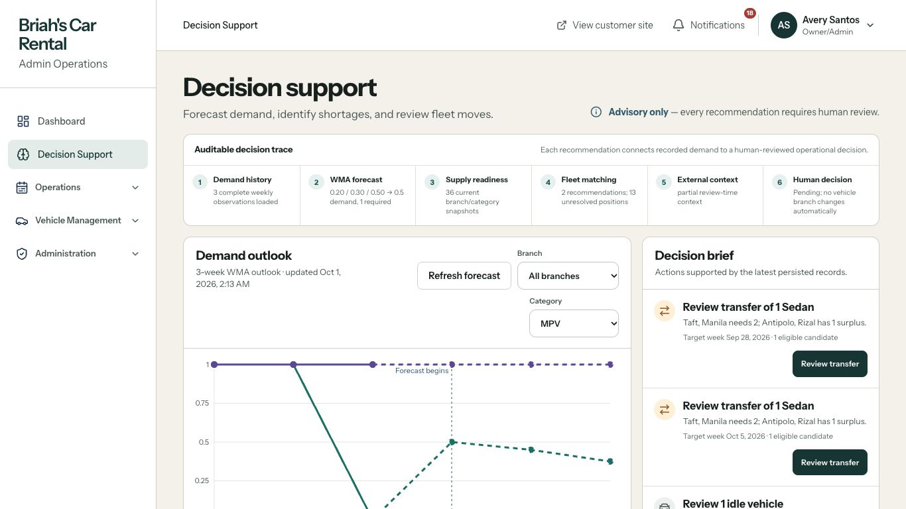
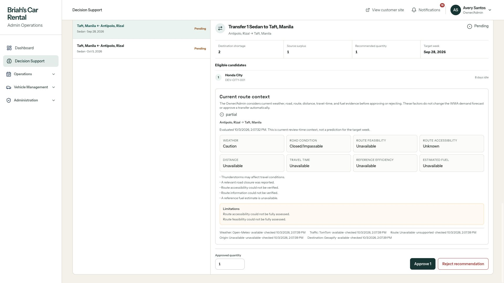
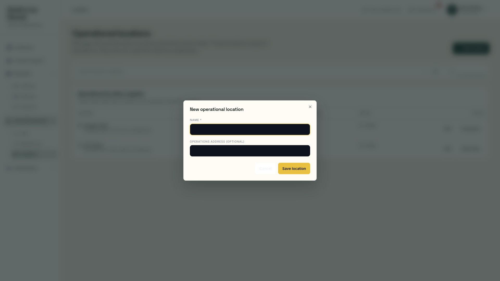
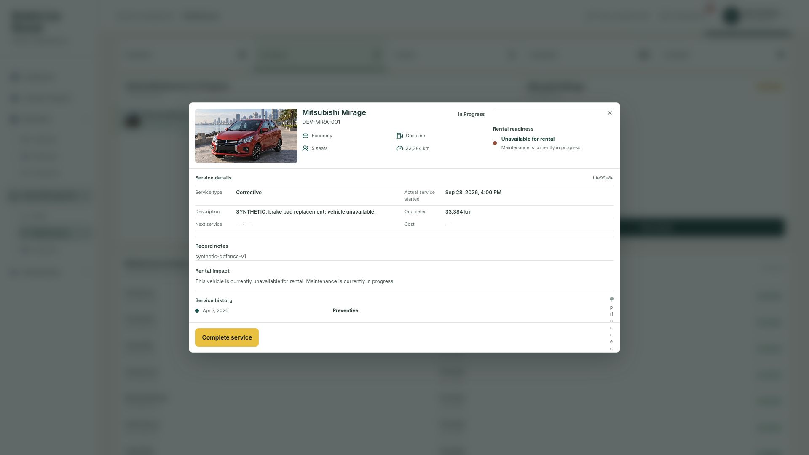

# Frontend layout and workflow audit — 3 October 2026

## Verdict

The main rental screens are functional, but the frontend is not yet ready to call finished. The most important remaining work is a focused DSS review redesign and several specific functional fixes. A wholesale redesign of the rental workflow is unnecessary.

The external factors belong in this DSS: weather, road conditions, route feasibility, distance, travel time, and indicative fuel cost help an administrator assess a proposed transfer. The problem is how the page connects these factors to a particular recommendation and communicates uncertainty. Detailed calculations, provider diagnostics, and audit metadata should remain available as supporting evidence, rather than competing with the decision itself.

This audit does not certify forecasting accuracy, real-world effectiveness, research validity, or every business transaction. It evaluates the frontend and the observable handoffs around those capabilities.

## Scope and evidence

- Repository: `main`, HEAD `02705878`; live site: <https://briahcarrental.site>.
- Live inspection used the existing synthetic Owner/Admin, Operations Staff, and Customer accounts. Credentials are not included in this report.
- Desktop layouts inspected at 1920×1080 and 1366×768, with representative customer and DSS layouts at 390×844. These are browser viewport checks, not physical-device touch tests.
- Reviewed public home/sign-in/vehicle finder; admin Dashboard, DSS, Bookings and booking detail, Requirements queue, Payments, Calendar, Fleet and vehicle editor, Maintenance detail, Locations dialog, Reports, Users & Roles, Audit Trail, and Notifications; customer My Bookings, payment handoff, Profile, and Notifications; staff Reports, Bookings/detail, Notifications, and the DSS access handoff.
- Source review covered route guards, responsive controls, modal portals and theme variables, notifications, customer images, report labels, and DSS state/date formatting.
- Waited for loaded content before assessing final layouts. Loading-state findings are explicitly identified below.
- No business action was submitted: no booking confirmation, payment verification, allocation approval, vehicle movement, document review, or profile save. No application code was changed. Normal page loading may request or generate application context through existing effects.
- Mutation outcomes, complete keyboard/screen-reader journeys, tablet layouts, physical touch, offline behavior, bundle size, and measured performance remain untested. Vehicle-finder submission through a new booking and every customer reupload/return state were not replayed in this pass.
- Technical checks used the installed Impeccable audit guidance and the current [Web Interface Guidelines](https://raw.githubusercontent.com/vercel-labs/web-interface-guidelines/main/command.md). This is one reviewer’s technical and UX assessment, not an independent multi-reviewer critique.

### Audit health assessment

Scores below are provisional review ratings, not WCAG certification.

| Dimension | Rating | Evidence / limitation |
|---|---:|---|
| Accessibility | 2/4 | Skip links and labeled controls exist; maintenance dialog lacks its accessible title, and a location-dialog Cancel label has very poor contrast. Full keyboard and screen-reader testing remains. |
| Performance | Not scored | Images reserve dimensions and support lazy loading. No Lighthouse, network timings, bundle analysis, or frame-rate measurements were performed. |
| Responsive design | 2/4 | Main pages adapt and wide DSS tables have local scrolling; the desktop fleet view loses a necessary allocation control, and mobile DSS review is excessively long. |
| Theming | 2/4 | Main admin theme is coherent; portaled generic dialogs can inherit the dark root tokens and produce unreadable controls. |
| Implementation integrity | 2/4 | Product-specific workflows and evidence exist, but disconnected DSS scopes, dead role-specific links, inconsistent references, and premature empty states mislead users. |

No aggregate score is given because measured performance and comprehensive accessibility coverage are missing. The implementation has a coherent rental-product identity, but fails a frontend completion gate on the findings below. This is not evidence that it needs a new visual identity.

The deterministic detector returned two advisory warnings: Instrument Sans in `src/routes/__root.tsx:113` and an unread border marker in `src/components/notifications/NotificationsPanel.tsx:568`. Neither is a verified defect. Keep the existing font and meaningful unread marker unless another concrete issue warrants changing them. Raw output: [detector.json](frontend-audit-2026-10-03/detector.json).

## Prioritized findings

There are **15 grouped findings: 7 P1 major and 8 P2 refinement findings**. No P0 system-wide blocker was confirmed. A P1 can block a particular task while another route or viewport provides a workaround. Subproblems within a grouped finding are not counted again.

### F01 — P1: Desktop fleet allocation control is missing

**Evidence:** Live desktop inspection and source. The vehicle editor disables Allocation location and tells the administrator to use the Fleet allocation-location control. The desktop register displays a plain branch value; the control exists only in `FleetDisclosure`, which is hidden at desktop widths.

**Locations:** `src/routes/admin.fleet.tsx:803` desktop register; `:842` smaller-screen disclosure; `:1055` location select; `:1556` editor instruction. The existing movement checks are in `changeBranch` / `commitBranch` around `:347` and `:373`.

**Impact:** An administrator can approve a recommendation but cannot find the desktop control needed to carry out the human-approved movement. Approval correctly does not move vehicles automatically; the follow-through is what is missing.

**Fix:** Expose the existing allocation-location action in desktop vehicle details or the register. Reuse the current booking-impact review and acknowledgment. After approval, offer a clear path to Fleet with the relevant source branch/category, while preserving manual vehicle choice.

**Acceptance:** At 1920 and 1366, an admin can locate the action, review affected requests, cancel safely, and deliberately move an eligible vehicle. Staff does not gain new permissions. A recommendation approval alone still does not move a vehicle.

### F02 — P1: Direct Payments navigation redirects a signed-in admin to Sign in

**Evidence:** Reproduced by directly opening `/admin/payments` while signed in. Opening Dashboard subsequently preserved the admin session, and navigating to Payments through the sidebar worked.

**Locations:** `src/routes/admin.payments.tsx:49`; analogous guards in `src/routes/admin.requirements.tsx:25`, `src/routes/admin.payments.$paymentId.tsx:37`, and `src/routes/admin.requirements.$bookingId.tsx:37`. `src/lib/admin-auth.ts:180` reads `getClientPrincipal`; `src/lib/auth-client.ts:5` returns null when `document` is unavailable.

**Cause:** These guards read a client-only principal during route loading without the SSR handling used elsewhere. The Payments reproduction is confirmed; the other three guards have the same source-level risk and need individual retesting.

**Fix:** Use consistent server-aware or hydration-safe route authentication and retain the intended destination. Keep server/API authorization intact; do not weaken access control to conceal the redirect.

**Acceptance:** Signed-in admins can paste and reload every affected URL; signed-out users are redirected appropriately; staff remains denied admin-only review actions.

### F03 — P1: DSS week labels lose a day through UTC conversion

**Evidence:** Source and isolated reproduction of the current helpers. For a Monday start of `2026-09-28`, `weekEndFromStart` returns `2026-10-04`, although the exclusive seven-day boundary is `2026-10-05`. Given the correct exclusive boundary, `formatWeekRange` displays an inclusive end of `2026-10-03` rather than Sunday `2026-10-04`. Live DSS labels also showed September 28–October 3.

**Locations:** `src/routes/admin.decisions.tsx:246` and `:252`. The forecast endpoint builds its exclusive end with `isoDay(addWeeks(t, 1))` in `src/routes/api.forecasts.ts:146`.

**Cause:** A Manila-midnight date is converted to UTC, then sliced into a date-only string and interpreted as Manila again. This shifts the calendar day.

**Fix:** Use the existing business-date utilities, or date-only calendar arithmetic, consistently. Distinguish exclusive stored ends from inclusive display ends. This finding concerns UI helpers, not proof of an incorrect WMA result.

**Acceptance:** September 28–October 4 and October 5–October 11 display correctly in chart tooltips, calculation subtitles, planning selectors, and unresolved-gap labels, including in a browser outside the Manila timezone.

### F04 — P1: DSS evidence and recommendations show different scopes without a clear connection

**Evidence:** Live at 1920 and 1366. The forecast was filtered to MPV, the calculation example was Taft MPV for September 28, the decision brief offered Sedan transfers for September 28 and October 5, and branch balance could show October 12. Each can be a valid record, but the page reads like one connected explanation. Review transfer changes the selected recommendation and scrolls to the section; it does not align the forecast/category/week context.

**Locations:** `src/routes/admin.decisions.tsx:449` separate context states; `:816` focused forecast; `:856` supply selection; `:1037` decision trace; `:1426` Review transfer handler.

**Impact:** A user or panelist cannot readily establish which demand/supply evidence justifies the selected transfer. This is a presentation/traceability issue, not proof that the allocation calculation is wrong.

**Fix:** Make the selected recommendation the review context: source branch, destination branch, category, target week, quantity, and corresponding forecast/supply snapshot. Either synchronize the chart when opening it or explicitly label the chart as a separate overview. Label an all-branches calculation example as an example, not as evidence for every recommendation.

**Related flow:** Review transfer currently scrolls to the section heading, with 13 expanded unresolved gaps before the selected review. At narrow widths this is a long interruption. Open the selected recommendation directly in a dedicated review panel; collapse unresolved gaps into a count and expandable list.

**Acceptance:** Clicking any recommendation immediately exposes that recommendation and its exact source/destination evidence. Changing the target week cannot leave misleading evidence from another week visible as its justification.

### F05 — P1: External risk and review readiness are not clear enough around approval

**Evidence:** The selected transfer showed a reported Closed/Impassable road condition, weather Caution, unknown access, and unavailable route feasibility/distance/time/fuel details. These appear among many similarly styled facts and provider diagnostics. Approve remains enabled while operational context is loading. The approval action submits directly, without an explicit review acknowledgment or confirmation.

**Locations:** `src/components/site/operational-context-panel.tsx:105`; `src/routes/admin.decisions.tsx:549` context effect, `:698` decision submission, and `:2017` action disabling.

**Impact:** The user can approve before the risk evidence has finished loading and may overlook a reported closure or mistake unavailable evidence for a safe route. The source also retains the previous context while a different recommendation loads, so old context must not be presented as belonging to the new selection.

**Fix:** Lead with a concise advisory summary, timestamp, and verification state. While loading, display a distinct pending review state and clear or visibly mark previous evidence. Once resolved, allow a deliberate human decision with explicit acknowledgment of missing/flagged context and a clear explanation of what approval records. Record decision reasons where the existing domain model supports them; any new persistence must be designed separately.

**Do not:** Automatically reject every transfer with unavailable external data, treat advisory closure data as independently verified fact, let external context silently alter WMA, or remove external factors to simplify the screen.

**Integration follow-up:** The observed review had an unresolved origin and unsupported route provider. Investigate branch coordinates/provider configuration separately. This observation does not prove every route is unavailable.

**Acceptance:** No enabled approval appears as review-ready while context is unresolved without a deliberate unavailable-context workflow. A closure/unverified route is prominent. Approval, rejection, and actual movement have distinct meanings.

### F06 — P1: Portaled admin dialogs inherit incompatible theme tokens

**Evidence:** The New location dialog had dark inputs and a nearly white Cancel label on a white background despite the light admin shell. Its Cancel button was enabled; computed text color was `oklch(0.97 0.005 250)` against `rgb(255,255,255)`.

**Locations:** `src/styles.css:3538` root tokens and `:3624` scoped admin tokens; `src/components/ui/dialog.tsx:39` body portal; `src/routes/admin.branches.tsx:383` generic dialog; `src/components/admin/ui.tsx:149` and `:180` token-dependent controls.

**Impact:** Basic cancellation and input affordances become difficult to see. The observed text contrast does not meet normal-text WCAG AA expectations. This persists at 1920; a larger screenshot does not fix it.

**Fix:** Apply the intended admin theme to portaled admin dialog content through a shared mechanism. Inspect all generic admin dialogs rather than patching only the Cancel text. Existing specially themed fleet/maintenance dialogs do not establish that every dialog is broken.

**Acceptance:** Inputs, labels, placeholders, disabled states, Cancel, primary actions, and focus rings have readable contrast across admin dialogs.

### F07 — P1: Maintenance detail has an unnamed dialog and a clipped history count

**Evidence:** Live maintenance detail at 1920 showed “1 prior record” wrapping vertically into a tiny column. Browser warnings reported a missing DialogTitle and description. The accessibility tree did not expose a meaningful vehicle/title name for the dialog.

**Locations:** `src/routes/admin.maintenance.tsx:694` dialog content and `:934` history section; `src/styles.css:8416` broadly styles every direct child span as a 0.55rem dot, including the history count.

**Fix:** Add an accessible dialog title tied to the visible heading and an appropriate description (or intentional description handling). Give the timeline dot its own class so the header count retains normal width. The clipped count is a P2 visual subproblem; the missing dialog name makes this grouped finding P1.

**Acceptance:** A screen reader receives the maintenance dialog’s vehicle/title; keyboard close/focus restoration works; the prior-record count stays horizontal at desktop and narrow widths.

### F08 — P2: Staff receives links and instructions for admin-only work

**Evidence:** Staff Reports offers Open decision support, but clicking it silently returns to Dashboard. Staff booking pages describe verifying documents/payments and setting fees although those controls are withheld. Expanding requirements review says it is unavailable for the exact booking, disguising the role restriction as missing data.

**Locations:** `src/routes/admin.reports.tsx:405`; `src/routes/admin.decisions.tsx:50`; `src/routes/admin.bookings.tsx:459`; `src/routes/admin.bookings.$bookingId.tsx:631`.

**Fix:** Keep permission boundaries. Hide inaccessible navigation, provide a clear Owner/Admin review handoff, and use staff-specific instructions about status, schedule, and operational duties. Do not add staff decision permissions just to make the link work.

**Acceptance:** Every staff action either works within the role or clearly identifies the required administrator. An inaccessible area never silently redirects as though the selected action succeeded.

### F09 — P2: Displayed booking references collide and differ across screens

**Evidence:** Multiple synthetic records display `C1000000` in Payments and booking details, while the booking list uses a distinguishing ID suffix. Full record URLs remain unique; this is a human-facing identifier problem, not a primary-key collision.

**Locations:** `src/lib/admin-presentations.ts:262`; `src/routes/bookings.$bookingId.tsx:394`; booking-list reference rendering.

**Fix:** Use one consistent, sufficiently unique display reference across admin/customer details, queues, payment review, notifications, and printouts. Preserve the underlying IDs. Include vehicle/date context and full-ID copy where appropriate.

**Acceptance:** An administrator can match a customer's displayed booking reference to exactly one queue item without opening multiple records.

### F10 — P2: Customer Profile displays inert account navigation

**Evidence:** Contact preferences and Security look like navigation options but are plain spans without a destination. On narrow screens, this account rail also takes substantial vertical space before the editable form.

**Location:** `src/routes/customer_.profile.tsx:183`.

**Fix:** Link only implemented destinations, such as the actual notification preferences where appropriate, or remove the navigation appearance. Keep account identity compact on mobile. Do not introduce a new security/password feature purely to justify an existing decorative label.

**Acceptance:** Every navigation-looking option has a working destination, and the profile form is easy to reach at 390px.

### F11 — P2: Loading states announce empty results, and DSS Refresh labels conceal regeneration

**Evidence:** DSS briefly announces no transfer/imbalance before forecast, supply, and recommendation loads complete; the loaded state contains pending recommendations and unresolved gaps. Customer Notifications initially says “You’re all caught up” and displays email preference off before its data arrives.

**Locations:** `src/routes/admin.decisions.tsx:1858`; `src/components/notifications/NotificationsPanel.tsx:330` and `:356`. DSS generation starts at `src/routes/admin.decisions.tsx:581` with dependent effects around `:939`.

**Fix:** Separate loading, failed load, genuinely empty results, and completed analysis. Avoid defaulting unknown preferences to a visually authoritative Off state. Buttons that create new persisted forecast/supply/recommendation runs should say Recalculate or Update analysis and explain the resulting snapshot, rather than looking like a simple page refresh.

**Additional clarity:** “36/36 ready” refers to analysis coverage, not 36 rental-ready vehicles. Label it as balance checks or snapshots prepared. Show the run timestamp and freshness together. Existing snapshots and live external context may have different timestamps; make this visible.

**Acceptance:** Slow loading never announces “no transfer needed” before analysis is ready. Refreshing existing data and creating a new analysis run are distinguishable. Analysis counts cannot be mistaken for fleet counts.

### F12 — P2: Report demand labels imply a different calendar period

**Evidence:** Reports labels the horizon-one table “Next-week demand,” while the loaded October 1 run has a September 28 target week. On October 3 that is the current week, not the following calendar week.

**Location:** `src/routes/admin.reports.tsx:468` and horizon-one selection/rendering immediately below it.

**Fix:** Use “First forecast week” or an explicit target-week range and run timestamp. Show period/sample definitions consistently for accuracy. Reports displayed 38.93% on 25 eligible samples, versus DSS 37.0% on 164 samples: these differing scopes are not proof of contradictory calculations, but should be clear to a reader.

**Hierarchy refinement:** Reports repeats detailed DSS/comparison evidence before operational charts and again in subsequent comparisons. Lead with business results; make technical evidence expandable or place it in a clearly identified report section.

**Acceptance:** A reader can identify the target week, generation date, accuracy sample count, and selected reporting period without inferring them from another screen.

### F13 — P2: Some vehicle images fall back, and the image component cannot recover after a source change

**Evidence:** Ford Everest showed a fallback in several inspected customer/booking screens while other vehicles loaded. The actual asset/configuration cause is not established. Source confirms that once `failed` becomes true, a new `src` does not reset it.

**Location:** `src/components/customer/CustomerPrimitives.tsx:54` through `:81`.

**Fix:** Check the affected vehicle's image asset/reference, and reset failure state when the source changes. Preserve reserved image space and accessible fallback text. No fabricated replacement image is needed.

**Acceptance:** Valid images render; failed images provide an appropriate fallback; a later valid source recovers without remounting the whole page.

### F14 — P2: Notification rows lack enough context to distinguish work items

**Evidence:** Several admin Rental overdue entries have almost identical titles/messages without a visible vehicle, customer, or booking reference. The user must open each one. Historical customer messages describe earlier next steps even after a rental is completed; these are legitimate events but can be mistaken for current instructions.

**Location:** `src/components/notifications/NotificationsPanel.tsx:575` notification row.

**Fix:** Include appropriate entity context, a clear event timestamp, and a distinguishable reference. In customer views distinguish the historical event from the booking's current next action. Preserve legitimate reminders and event history; repeated messages alone do not establish duplicate-event defects.

**Acceptance:** Users can distinguish two overdue rentals from the inbox. An old payment invitation is not presented as the current required action for a completed booking.

### F15 — P2: Security-deposit copy contradicts its payment timing

**Evidence:** The payment quote heading says “Refundable security deposit (upon vehicle return)” while the explanation says it is collected at handover and refunded subject to terms.

**Location:** `src/routes/bookings.$bookingId.tsx:1950`.

**Fix:** State the timing directly: “Security deposit — payable at handover; refundable after return, subject to the agreed terms.” Verify the wording against the actual business policy. Also distinguish “downpayment due now” from a downpayment already received, instead of implying payment has occurred before submission.

**Acceptance:** The quote consistently explains what is due now, what is due at handover, and what is refundable after return. The inspected payment amount itself was not shown to be incorrect.

## DSS screen structure to implement

The page should answer **what needs a decision, why, and what the administrator must check before acting**.

1. **Planning context:** target week, category, branch/overview scope, latest analysis timestamp, and a clearly named Update analysis action.
2. **Decision overview:** pending transfer count, unresolved shortage count, and idle/readiness attention. These must be labeled as decisions or analysis findings, not as available-vehicle totals.
3. **Recommendation list:** source → destination, category, suggested quantity, target week, shortage addressed, decision state, and a concise risk/verification indicator. Review opens the exact selected record.
4. **Selected recommendation:** human-readable rationale, exact source/destination demand and projected supply, suggested versus approved quantity, and existing booking/readiness constraints.
5. **External advisory summary:** reported weather/road issues, route verification state, and observation timestamps. Distance/time/fuel appear here when verified; unavailable values have a clear reason and manual-verification instruction.
6. **Decision action:** approve/reject with clear consequences and deliberate review of uncertainty. Explain that approval records a recommendation decision; actual movement remains a separate, manually verified fleet action.
7. **Expandable evidence:** WMA input weeks/weights/calculation, accuracy and exclusions, snapshot/run IDs, detailed route assumptions, and provider diagnostics. Preserve evidence needed for defense without forcing it into the primary task.
8. **Follow-through:** link to the existing Fleet location workflow after approval; distinguish Pending, Approved, Rejected, and actual vehicle location. Do not introduce an unimplemented “Executed” status.

Use a dedicated review panel or drawer rather than a long form hidden after all unresolved-gap rows. Keep unresolved shortages inspectable because a shortage without an eligible donor is meaningful DSS output.

## Focused implementation phases

### Phase 1 — Repair functional and presentation defects

Fix F01–F03, F06, and F07 first: desktop location control, route guards, date labels, shared modal theme, and maintenance semantics/count styling. These are precise corrections with no need to change the manuscript's core objectives.

Verify signed-in direct URLs/reloads, admin/staff permissions, affected-request movement acknowledgment, Manila week boundaries, modal keyboard/focus/contrast, and layouts at 1920/1366/390. Use disposable/resettable defense records only for later mutation tests; this audit did not submit them.

### Phase 2 — Make DSS decisions coherent and defensible

Implement F04–F05 and the DSS portions of F11–F12. Align selected evidence, open review directly, expose advisory risks and missing-data handling, clarify generation/freshness, and connect approval to the existing Fleet action. Preserve WMA, utilization/idle monitoring, allocation, external factors, and human authority.

Verify cases with a useful transfer, no eligible donor, unavailable external context, a reported closure, a different week/category selection, rejection, partial approved quantity, and manual movement affecting a pending request. Test the calculations separately from UI organization; a layout improvement is not forecast validation.

### Phase 3 — Finish role and customer refinements

Resolve F08–F15: staff-safe navigation/copy, consistent references, profile navigation, accurate loading states, report period clarity, images, notifications, and deposit wording.

Then replay one complete customer → admin review → payment → release → return journey and one recommendation → human decision → fleet-location journey, followed by focused keyboard and responsive checks. Confirm no permission or rental-state regression.

Suggested skill routes, if used for implementation: `$impeccable harden` for guarded/loading/image behavior; `$impeccable adapt` for desktop/mobile control parity; `$impeccable clarify` for context, risk, role, and payment copy; `$impeccable layout` / `$impeccable distill` for DSS hierarchy; re-run `$impeccable audit` after fixes; finish with `$impeccable polish`. These are optional implementation aids, not changes already performed.

## What is working and should be preserved

- Clear desktop operational shell, useful dashboard next-action links, and separate admin/customer navigation.
- Owner requirements review opens the exact rental request and keeps verification disabled until required outcomes are supplied.
- The customer payment handoff opens the correct booking and presents the quoted amount with payment-method/proof gating.
- Staff does not receive admin mutation controls. Correct the surrounding navigation/copy while preserving that boundary.
- Allocation approval is separate from moving a vehicle, and the existing movement handler checks affected requests.
- Forecast/calculation/supply evidence and external advisory states are available. Reorganize them; do not discard the innovation or traceability.
- Wide DSS tables scroll locally at the inspected narrow viewport; no body-wide overflow was confirmed there.
- Skeletons, image dimensions/lazy loading, skip links, and reduced-motion handling are already present in important shared paths.
- Staff Notifications loaded successfully in this current pass. Do not carry an earlier temporary loading failure forward as an unresolved defect.

## Evidence images

The images below are actual current live screens, not mockups or repaired layouts.

### DSS overview at 1366×768

### DSS external advisory review at 1920×1080

### Location dialog at 1920×1080

### Maintenance dialog at 1920×1080

## Completion rule

Reassess after the fixes against the acceptance checks above. A cleaner screenshot is insufficient: correct routes, roles, context linkage, date labels, review readiness, and manual allocation follow-through are what make the DSS frontend defensible. Synthetic data can demonstrate these workflows but cannot establish real-world predictive performance.
